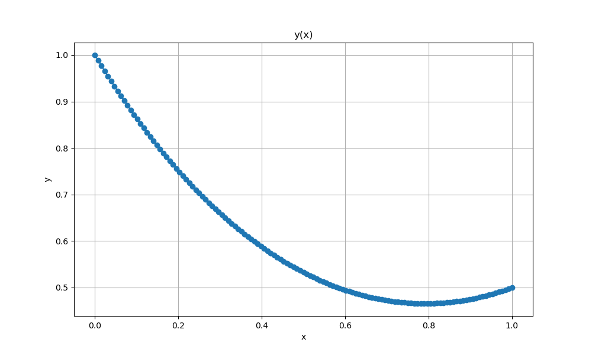
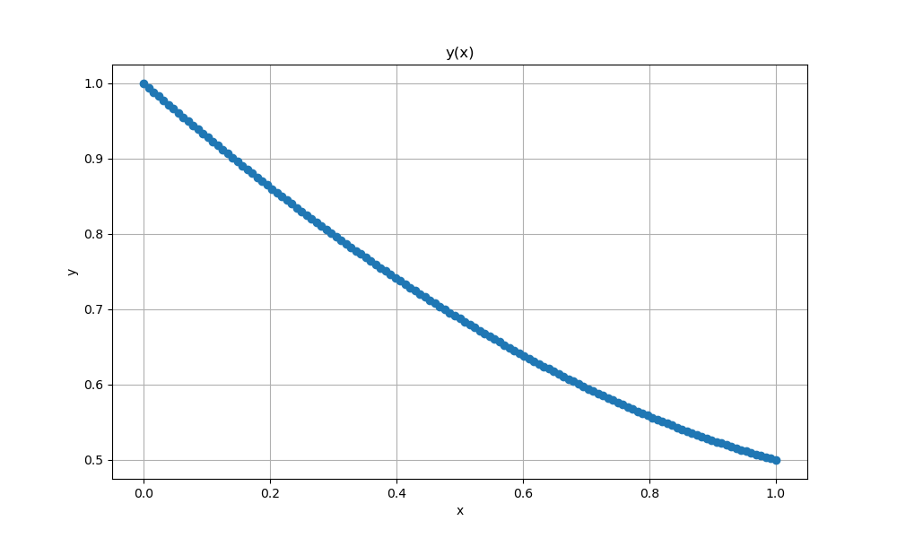

# BoundaryTask

> [!TIP]
> Многопоточная реализация **решения краевой задачи** с использованием технологии **MPI** (Message Passing Interface). Выполнено с помощью аппроксимации Нумерова с линеаризацией по Ньютону и последующей заменой прогонки редукционным алгоритмом.
>


-----------------------------------------------------------------------------

## Содержание

[1. Алгоритм рассчета](#2)

[2. Конкретные виды задач](#3)

[3. Замеры производительности](#4)

[4. Сборка и запуск](#1)

-----------------------------------------------------------------------------
<a name="2"></a>
## Алгоритм рассчета


Рассматривается **краевая задача** вида:

**$$\frac{d^2y(x)}{dx^2} = f(x, y), x_0 <= x <= x_M, y(x_0) = a, y(x_M) = b$$**

, где M - количество точек, на которые будет разделён интервал.

В 1924 году Б. **Нумеров** для нелинейных функций, не зависящих от первой производной решения, предложил «компактную» **аппроксимацию четвертого порядка**. Она имеет вид:

$$\frac{y_{m-1} - 2y_{m} + y_{m+1}}{h^2} = f_m + \frac{1}{12}(f_{m-1} - 2f_m + f_{m+1})$$

Воспользуемся **линеализацией Ньютона** для представления произвольной функции f в линейном виде. Представим решение в виде:

$$y(x) = y^0(x) + v(x)$$

, где $y^0$ - грубое приближение решения, удовлетворяющее краевым условиям, а v - считаем малой поправкой к грубому решению. Построим грубое приближение решения y^0 в виде линейной функции, проходящей через краевые точки:

$$y^0(x) = y(x_0) + \frac{y(x_M) - y(x_0)}{x_M - x_0} (x - x_0) = a + \frac{b - a}{x_M - x_0}(x - x_0)$$

Разложим функцию f по y в окресности $y^0$:

$$f(x, y(x)) = f(x, y^0(x) + v(x)) = f(x, y^0(x)) + \frac{df}{dy}(x, y^0(x))v(x) + o(v^2(x)) = f_m^0 + \frac{df_m^0}{dy}v_m$$

Сведём задачу к нахождению v(x), при этом правая часть будет зависить линейно от v(x), что говорит о том, что апроксимированная задача может быть сведена к:

$$\frac{y_{m-1} - 2y_{m} + y_{m+1}}{h^2} = f_m + \frac{1}{12}(f_{m-1} - 2f_m + f_{m+1})$$

$$\frac{y_{m-1}^0 + v_{m-1} - 2y_{m}^0 - 2v_m + y_{m+1}^0 + v_{m+1}}{h^2} = f_m^0 + \frac{df_m^0}{dy}v_m + \frac{1}{12}(f_{m-1}^0 + \frac{df_{m-1}^0}{dy}v_{m-1} - 2f_m^0 - 2\frac{df_m^0}{dy}v_m + f_m^0 + \frac{df_{m_1}^0}{dy}v_{m+1})$$


$$a_m v_{m-1} + b_m v_m + c_m v_{m+1} = g_m$$

, где 

$$a_m = 1 - \frac{1}{12}\frac{df_{m-1}^0}{dy}h^2$$

$$b_m = -2 - \frac{5}{6}\frac{df_{m}^0}{dy}h^2$$

$$c_m = 1 - \frac{1}{12}\frac{df_{m+1}^0}{dy}h^2$$

$$g_m = y_{m-1}^0 - 2y_m^0 + y_{m+1}^0 + \frac{1}{12}h^2(f_{m-1}^0 + 10f_m^0 + f_{m+1}^0)$$


Теперь можем воспользоваться **методом редукции**. Для этого распишем три последовательных итерации для m-1, m, m+1. Первое уравнение умножим на $-a_m/b_{m-1}$, а третье на $-c_m/b_{m+1}$, после чего сложим со вторым. Вместо второго теперь получим:


$$a_m' v_{m-2} + b_m' v_m + c_m' v_{m+2} = g_m'$$

, где 

$$a_m' = - \frac{a_m a_{m-1}}{b_{m-1}}$$

$$b_m' = b_m - \frac{a_m c_{m-1}}{b_{m-1}} - \frac{c_m a_{m+1}}{b_{m+1}}$$

$$c_m' = - \frac{c_m c_{m+1}}{b_{m+1}}$$

$$g_m' = g_m - \frac{a_m}{b_{m-1}}g_{m-1} - \frac{c_m}{b_{m+1}}g_{m+1}$$

Видно, что это уравнение имеет такую же структуру как и исходное, только связывает значения $v_{m-2}, v_m, v_{m+2}$. Если заменить m = 2k и применить подобное редукционное преобразование ко всем уравнениям с четными k, кроме граничных условий, то получим в два раза меньше уравненений. Таким образом, проделывая такую же последовательность действий над этими уравнениями в итоге получим связь между краевыми точками и центральной, это уравнение легко решается. 

То есть если изначально была $2^p + 1$ точка, топосле р шагов редукции получим простое линейное уравнение на центральную точкую.

Далее, мы уже считали коэффициенты на точку между первой краевой и центральной, и они же при точке между центральной и второй краевой. Проводя обратный ход редукции мы сможем восстановить значения y во всех точках.


-----------------------------------------------------------------------------
<a name="3"></a>
## Конкретные виды задач

Были рассчитаны несколько задач:

### **Легкий уроверь**

**$$y''(x) - e^{y} = 0,  y(0) = 1, y(1) = b$$**

, где b меняется от 0 до 1, пространстенный шаг h от 400 до 4000.

Траектория для b = 0.5 изображена на графике.

 

Если посмотреть, что происходит ближе к краю b, то видно, что после строгого минимума возрастание строгое.

 


### **Средний уровень**


**$$y''(x) - e^{-y} = 0,  y(0) = 1, y(1) = b$$**

, где b меняется от 0 до 1, пространстенный шаг h от 400 до 4000.


Траектория для b = 0.5 изображена на графике.

 

Если посмотреть, что происходит ближе к краю b, то видны быстрые колебания.

 


### **Тяжёлый уровень**


**$$y''(x) = A(y^3 - y),  y(-10) = y(10) = \sqrt{2}$$**

, где A меняется от 100 до 1000000, пространстенный шаг $h << \frac{1}{\sqrt{A}}$.


Траектория для A = 100 изображена на графике.

 


-----------------------------------------------------------------------------
<a name="4"></a>
## Замеры производительности


> [!IMPORTANT]
> * **Ускорение** - отношение времени выполнения последовательного алгоритма **$T_1$** ко времени выполнения параллельного алгоритма **$T_p$** на **p** процессорах. В нашем случае за наилучший последовательный алгоритм взят тот же алгоритм при запуске на одном потоке.
> **$$S = \frac{T_1}{T_p}$$**
> * **Эффективность**. Параллельный алгоритм может давать большое ускорение, но использовать процессоры неэффективно. Для оценки масштабируемости параллельного алгоритма используется понятие эффективности:
> **$$E = \frac{S}{p}$$**


### **Тяжёлый уровень**


**Видно, что для различных значений параметра A максимальное ускорение достигается для разного количества исполнителей.**


 

**Из графика эффективности видно, что наиболее эффективно параллелить программу с A = 10000 на двух исполнителях. Для других А распараллеливание неэффективно.**

### **Средний уровень**


**Видно, что здесь тоже для различных значений параметра b максимальное ускорение достигается для разного количества исполнителей.**


 

**Из графика эффективности видно, что распараллеливание неэффективно.**


-----------------------------------------------------------------------------
<a name="1"></a>
## Сборка и запуск

```bash
$ git clone https://github.com/kseniadobrovolskaia/ParallelComputing
$ cd ParallelComputing/BoundaryTask/
$ cmake -B build
$ cd build/
$ make
```

```bash
$ mpirun -n 4 ./BoundTask
```

Время рассчета будет напечатано на экране, а все состояния будут сохранены в файл *Calculations.txt* в формате " X   Y ".

 
> [!IMPORTANT]
> Для запуска программы должно быть установлено программное обеспечение для многопоточного программирования **MPI**. В частности компилятор **mpicc** и запускатор **mpirun**. Но скорее всего эти программы уже есть на вашем компьютере.


Для визуализации результата:

```bash
$ python ../Graphic.py
```
