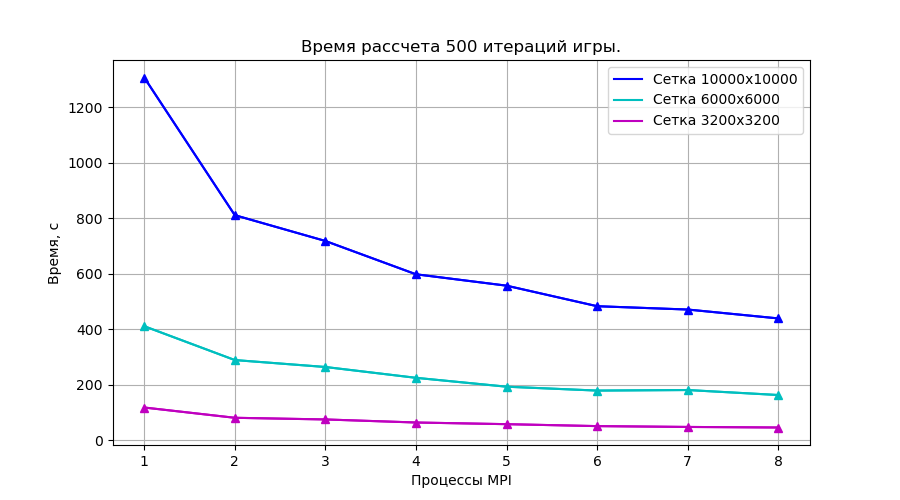
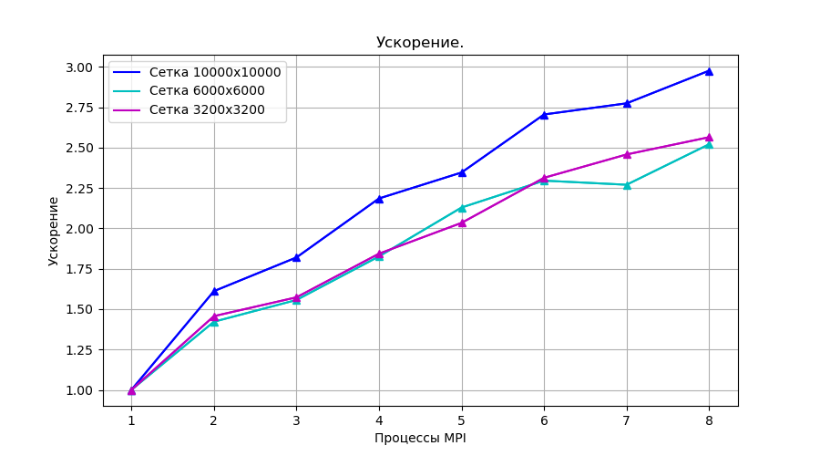
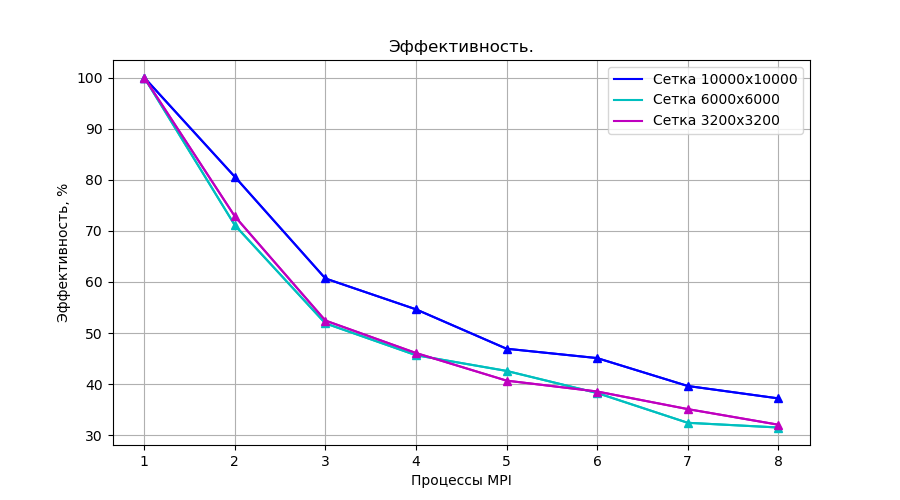

# GameOfLife 

> [!TIP]
> Многопоточная реализация **Игры Жизнь** с использованием **MPI**
>
> **Классические правила**: [вот](https://ru.wikipedia.org/wiki/%D0%98%D0%B3%D1%80%D0%B0_%C2%AB%D0%96%D0%B8%D0%B7%D0%BD%D1%8C%C2%BB)
>
> **Краткое описание**:
>  * Имеется прямоугольное двумерное поле типа тор (верх граничит с низом, левая сторона поля с правой), где у кажной клетки на каждом шагу есть состояние **1 - живая** или **0 - пустая**.
>  * Следующее состояние рассчитывается на основaнии текущего.
>  * Если с **пустой** клеткой граничат **3 живых** -- она становится живой.
>  * Если с **живой** клеткой граничат **3 или 2 живых** -- она остаётся живой.
>  * В других ситуациях поведение противоположное.

> [!IMPORTANT]
> * **gameOfLife** - программа, выполняющая рассчет состояния сетки и записывающая его на каждой итерации в файл.
> * **showMesh** - программа, которая читает этот файл и отображает состояния на каждом шаге, после всех рассчетов.


 


## Содержание

[1. Пример игры](#1)

Начальное состояние из файла

Рандомная генерация начального состояния

[2. Опции](#4)

[4. Сборка ](#2)

[5. Измерения производительности ](#3)


<a name="1"></a>
## Пример игры

### Начальное состояние из файла

Возьмём простое начальное состояние сетки 5x7 клеток:

```
$ cat In.txt
```
  ```
0000000
0000000
0011100
0000000
0000000
  ```
Запустим игру, указав для рассчета 3 процесса (-n 3):

```
$ mpirun -n 3 ./gameOfLife -r 5 -c 7 -s 5 -f In.txt
```

Посмотрим 3 шага рассчета:

```
$ ./showMesh Out.txt -r 5 -c 7 -s 3
```

```
Step 0

0000000
0000000
0011100
0000000
0000000


Step 1

0000000
0001000
0001000
0001000
0000000


Step 2

0000000
0000000
0011100
0000000
0000000
```

> [!TIP]
> Эта фигура называется **Мигатор (Blinker)**. 
>
> Есть много интересно-изменяющиxcя начальных состояний для этой игры, такие как: **Пульсар (Pulsar)**, **Планер (Glider)**, **Космический корабль (Spaceship)**. 
>
> Все фигурки делятся на три вида: *стационарные*, *периодические* и *ползущие*.
>
> Конкретно эти есть в директории **Examples**. Все они написаны для сетки 15x15. Пульсар - 21х21. Запускайте, любуйтесь и угадывайте вид! :smile:


### Рандомная генерация начального состояния

> [!NOTE]
> Для воспроизводимости рандомного начального состояния можно указывать **seed**.

Запустим программу без начального файла:

```
$ mpirun -n 4 ./gameOfLife -r 5 -c 7 -s 10
```

```
No start mesh file provided. Random generation start mesh state.
Seed is not provided. Using generated randomly: 1714300512
```

Посмотрим какое начальное состояние было сгенерировано:

```
$ ./showMesh Out.txt -r 5 -c 7 -s 2
```

```
Step 0

1001100
0001100
1111011
1001100
0001100


Step 1

0010010
0000000
1100011
1000000
0010010

```

Теперь это же начальное состояние может быть получено с помощью:

```
$ mpirun -n 4 ./gameOfLife -r 5 -c 7 -s 10 --seed 1714300512
```

Проверим это:

```
$ ./showMesh Out.txt -r 5 -c 7 -s 2
```

Действительно! :smile:

```
Step 0

1001100
0001100
1111011
1001100
0001100


Step 1

0010010
0000000
1100011
1000000
0010010
```


-----------------------------------------------------------------------------

 
 <a name="4"></a>
 ## Опции
 
 Все доступные опции можно узнать:
 ```
$ ./gameOfLife  --help
 ```
```
USAGE:     ./gameOfLife   [options]   -f  <start_mesh_state_file>

OPTIONS: 
     -h   --help
     -s   --count-steps
     -c   --mesh-colunms
     -r   --mesh-rows
     -f   --start-mesh-file
     -o   --out-mesh-file
          --seed

```


| Опция  | Алиас |Описание         |
|:------------- |:----------|:----------------------------:|
|  **--help**       |  **-h**          | Распечатать справку.|
| **--count-steps**        |  **-s**     |Задать количество шагов рассчета сетки. Обязательная опция. |
| **--mesh-colunms**        | **-c**   |Задать количество столбцов в сетке. В случае предоставления файла начального состояния, это количество должно совпадать со столбцами файла. Обязательная опция.|
| **--mesh-rows**       |  **-r**   |Задать количество строк в сетке. В случае предоставления файла начального состояния, это количество должно совпадать со строками файла. Обязательная опция.|
| **--start-mesh-file**      |  **-f**         | Задать файл начального состояния сетки. Без указания начальное состояние будет сгенерированно рандомно на основе *seed*.|
| **--out-mesh-file**      |  **-o**         | Задать файл для печати всех шагов рассчета. Без указания они печатаются в файл *Out.txt*.|
| **--seed**      |           | Число для рандомной генерации начального состояния. Без указания будет сгенерирован рандомно. Запрещено указывать вместе с опцией *-f* по разумным причинам. |

-----------------------------------------------------------------------------


<a name="2"></a>
## Сборка
 
 Клонирование и сборка двуx программ *gameOfLife* и *showMesh*:

```
  $ git clone https://github.com/kseniadobrovolskaia/ParallelComputing
  $ cd ParallelComputing/GameOfLife/
  $ cmake -B build
  $ cd build/
  $ make
```
 
> [!IMPORTANT]
> Для запуска программы должно быть установлено программное обеспечение для многопоточного программирования **MPI**. В частности компилятор **mpicc** и запускатор **mpirun**. Но скорее всего эти программы уже есть на вашем компьютере.

-----------------------------------------------------------------------------


<a name="3"></a>
## Измерения производительности

Для сеток: 3200x3200, 6000x6000, 10000x10000 были измерены времена рассчета 500 шагов рандомно сгенерированного начального состояния (разумеется с одинаковым seed = 1714331467) в зависимости от числа процессов MPI. Рассчеты проводились на 8-ми ядерном компьютере с процессорами Intel.

 

**Видно, что время уменьшается с увеличением числа процессоров.**


По этим данным были вычислены:

* **Ускорение** - отношение времени выполнения лучшего последовательного алгоритма **$T_1$** ко времени выполнения параллельного алгоритма **$T_p$** на **p** процессорах.

**$$S = \frac{T_1}{T_p}$$**

 

**Из графика видно, что ускорение меньше числа процессоров. Это связано с задержками на обмен сообщениями, а также с наличием операций алгоритма, которые не могут быть выполнены параллельно. Теоретическую оценку максимального ускорения алгоритма с долей последовательных операций $\alpha$ выражает закон Амдаля:**

**$$S = \frac{T_1}{T_p} = \frac{T_1}{\alpha T_1 + \frac{(1 - \alpha) T_1}{p}} <= \frac{1}{\alpha}$$**

* **Эффективность**. Параллельный алгоритм может давать большое ускорение, но использовать процессоры неэффективно. Для оценки масштабируемости параллельного алгоритма используется понятие эффективности:

**$$E = \frac{S}{p}$$**

 

**Видно, что хоть ускорение в среднем и растёт с увеличением количества процессов, но эффективность уменьшается. Это связано с задержками на синхронизацию вычислений и обменом информацией между процессорами.**


