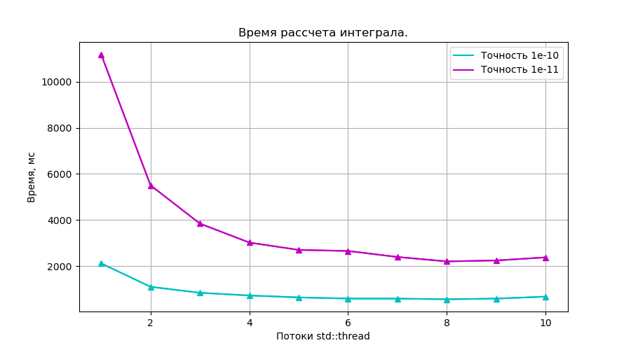
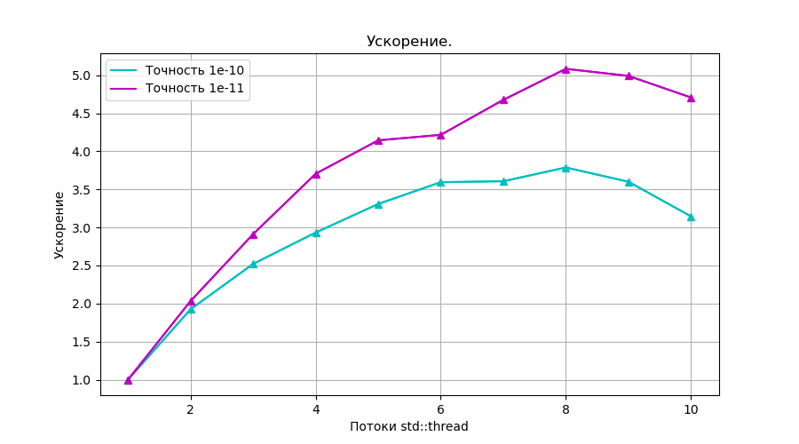
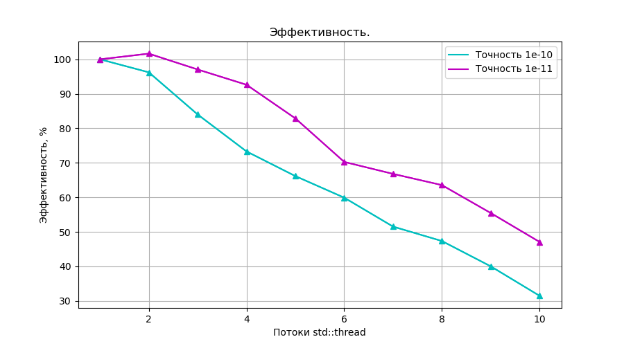

# Integral 

> [!TIP]
> Многопоточная реализация **интегрирования функции** с использованием **std::thread**.


## Запуск

```
  $ g++ Integral.cpp
  $ ./a.out 4 0.00000000001
```

* Первый аргумент: **число создаваемых потоков**

* Второй аргумент: **точность рассчета**

Программa рассчитает значение интеграла функции


**$$f = cos(\frac{1}{X - 5})$$**
 
на отрезке **[0.005, 4.995]**.

Выведет полученное значение,
а также время рассчета и число задействованных потоков.


Программа также предупреждает в случае несовпадения hardware потоков и указанных при запуске:

```
Warning! Hardware threads: 8, but you choose count threads: 4

Number of using threads: 4. Time: 3020 millisec.
Integral of a function on an interval [0.005, 4.995]: 3.5241704666
```

> [!IMPORTANT]
> Создаётся ровно столько потоков, сколько указано в аргументах запуска. 
>
> Исполнение начинает первый поток и при необходимости разбивает отрезок на более мелкие отрезки
> и делегирует часть вычислений другим потокам. Это реализация *динамической балансировки загрузки процессоров*.
>
> Таким образом, количество действительно используемых процессоров печается в конце программы.
-----------------------------------------------------------------------------


## Измерения производительности

Для точностей $10^{-10}$ и $10^{-11}$ были измерены времена рассчета в зависимости от числа потоков std::thread. Рассчеты проводились на 8-ми ядерном компьютере с процессорами Intel.

 

**Видно, что время уменьшается с увеличением числа процессоров. Это уменьшение заметно сильнее при более точных рассчетах.**


По этим данным были вычислены:

* **Ускорение** - отношение времени выполнения последовательного алгоритма **$T_1$** ко времени выполнения параллельного алгоритма **$T_p$** на **p** процессорах.

**$$S = \frac{T_1}{T_p}$$**

 

**Из графика видно, что ускорение меньше числа процессоров. Максимальное ускорение, как и ожидалось, достигнуто на 8-ми потоках и составляет 5.**

* **Эффективность**. Параллельный алгоритм может давать большое ускорение, но использовать процессоры неэффективно. Для оценки масштабируемости параллельного алгоритма используется понятие эффективности:

**$$E = \frac{S}{p}$$**

 

**Видно, что хоть ускорение в среднем и растёт с увеличением количества процессов, но эффективность уменьшается. Это, так же как и проседание ускорения, связано с задержками на создание потоков и синхронизацию обращений к разделяемым переменным.**


