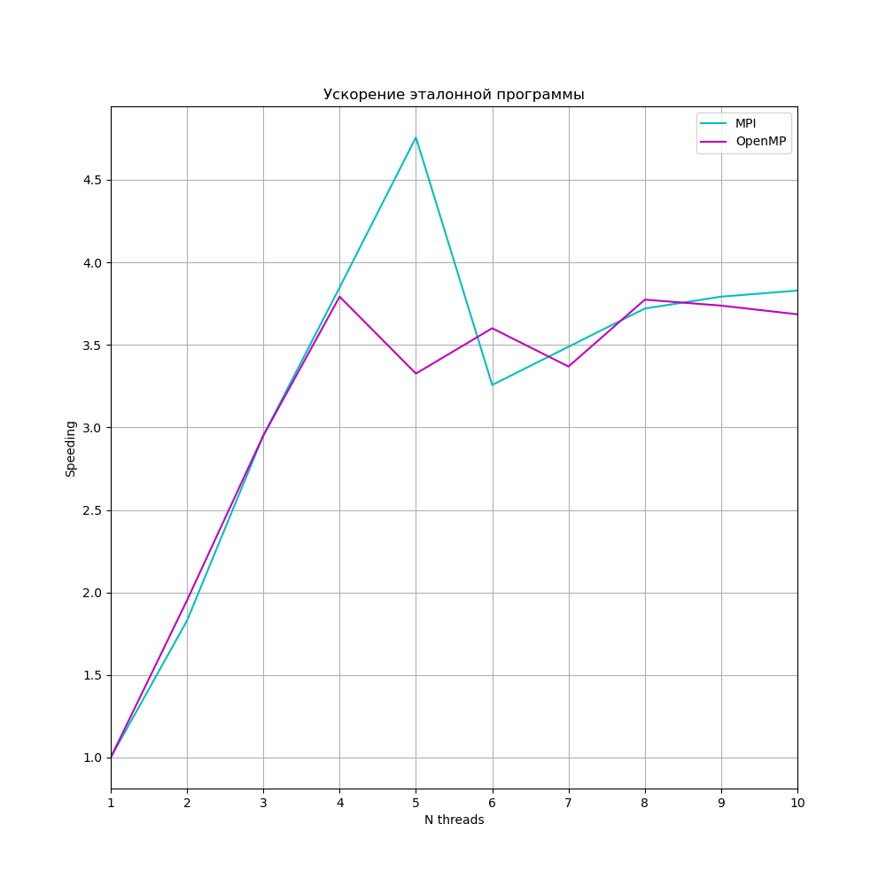
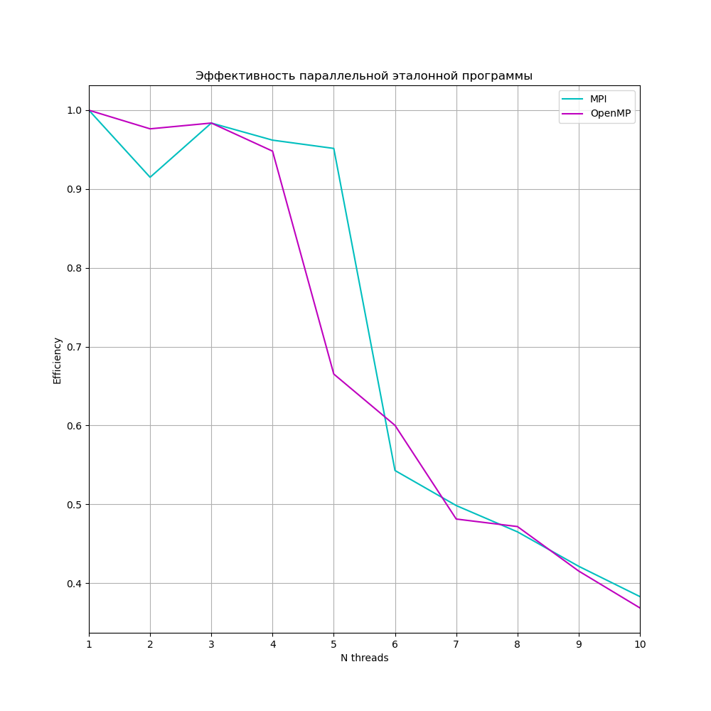
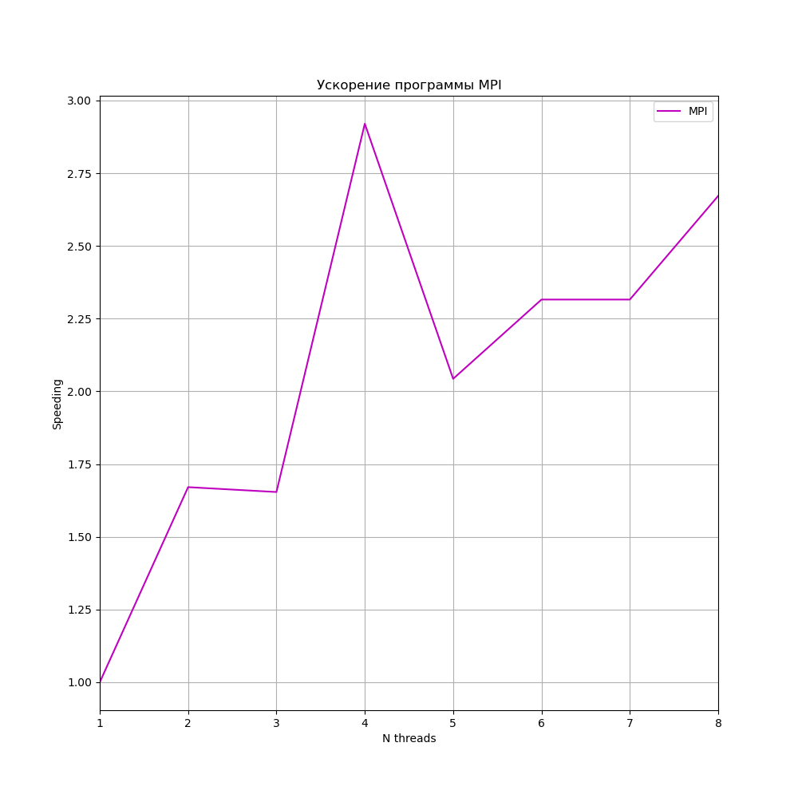
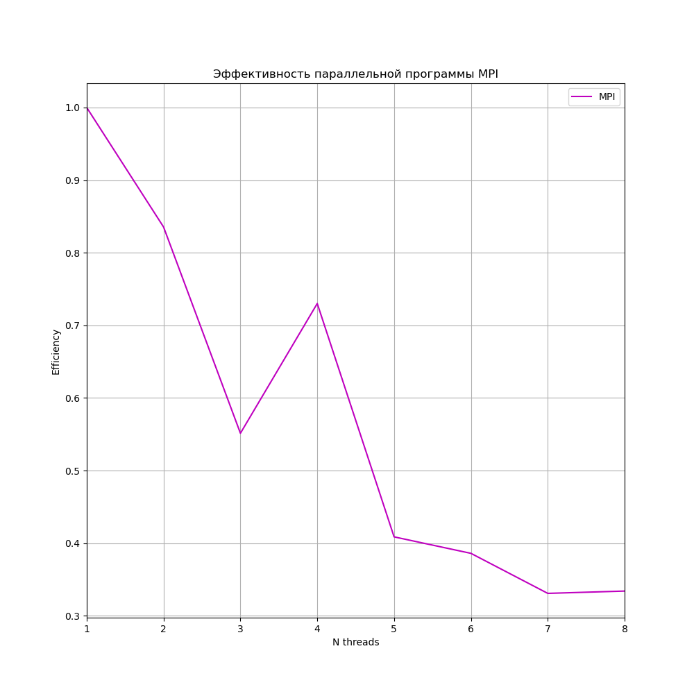
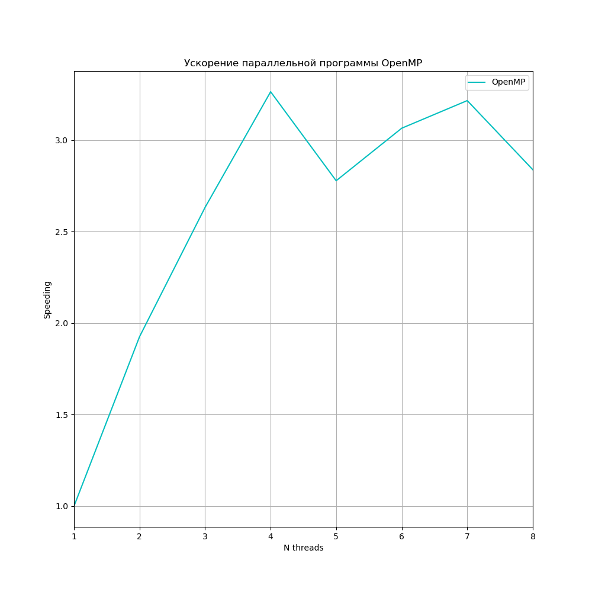
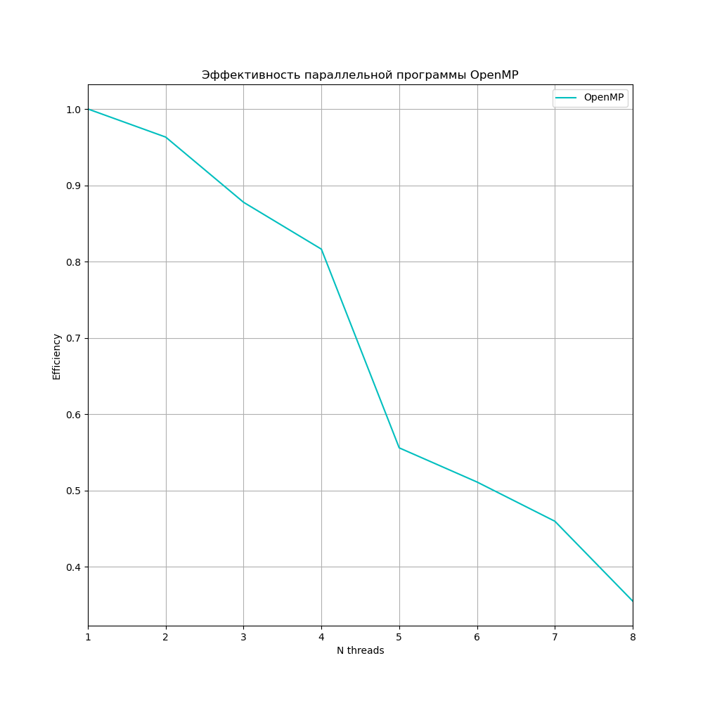

# Распараллеливание вложенных циклов

> [!NOTE]
> Основным заданием данной лабораторной работы является разработка и исследование параллельных программ, созданных на основе существующих заготовок последовательных программ. Полученные результаты требуется сравнить, а также изобразить графически для каждой из реализаций зависимость коэффициента ускорения программы от количества используемых исполнителей.


Лабораторная работа подразумевает выполнение распараллеливания при помощи двух разных технологий (с общей памятью **OpenMP** и с распределённой памятью **MPI**) трёх эталонных программ.

-----------------------------------------------------------------------------

## Содержание

[1. Анализ зависимостей во вложенных циклах](#1)


[2. Распараллеливание циклов](#2)


[3. Замеры производительности](#3)

-----------------------------------------------------------------------------


<a name="1"></a>
## Анализ зависимостей во вложенных циклах

Вычислим следующие характеристики последовательных программ, чтобы понять как можно их распараллелить.

1. **Вычислим вектор расстояний.**

2. **Вычислим вектор направлений.**

3. **Определим тип зависимости и возможные варианты распараллеливания.**

```c
#include <stdio.h>
#include <stdlib.h>
#define ISIZE 1000
#define JSIZE 1000

int main(int argc, char **argv) {
  double a[ISIZE][JSIZE];
  int i, j;
  FILE *ff;
  //подготовительная часть – заполнение некими данными
  for (i = 0; i < ISIZE; i++) {
    for (j = 0; j < JSIZE; j++) {
      a[i][j] = 10 * i + j;
    }
  }
  // требуется обеспечить измерение времени работы данного цикла
  for (i = 0; i < ISIZE; i++) {
    for (j = 0; j < JSIZE; j++) {
      a[i][j] = sin(2 * a[i][j]);
    }
  }
  ff = fopen("result.txt", "w");
  for (i = 0; i < ISIZE; i++) {
    for (j = 0; j < JSIZE; j++) {
      fprintf(ff, "%f ", a[i][j]);
    }
    fprintf(ff, "\n");
  }
  fclose(ff);
}
```

1. **Вектор расстояний:** 

**$$D = Λ − K$$**

, где из вектора итераций, соответствующего итерации стока зависимости, вычитаем вектор итерации, соответствующий итерации источника зависимости.


В этом цикле источник зависомости - $a[0][0] = ... => K = (0, 0)$, а сток зависимости - $... = sin(2 * a[0][0]); => Λ = (0, 0)$. Значит вектор расстояний **$D = (0, 0)$**.


2. Компоненты **Вектора направлений**, определяются следующим образом:

* $d_i = =, D_i = 0$
* $d_i = >, D_i < 0$
* $d_i = <, D_i > 0$

**d = (=, =)**

3. Так как многомерный цикл имеет вектор направлений **d = (=, =)**, то цикл может быть распараллелен по произвольному количеству индексов без всяких ограничений. При этом циклы, соответствующие различным уровням вложенности первоначальной конструкции, можно безопасно менять местами. Эту программу будем параллелить с помощью обоих технологий.

Чтобы упростить программу, можно переписать её, совместив инициализацию с главным циклом и циклом печати в файл, что позволит не заводить массив огромных размеров. При этом возможно увеличить ISIZE и JSIZE до 5000:

```bash
$ batcat SequentialProgram1.c
```

```c
#include <stdio.h>
#include <stdlib.h>
#include <math.h>

#define ISIZE 5000
#define JSIZE 5000

int main(int argc, char **argv) {
  int i, j;
  FILE *ff;
  
  ff = fopen("Seq1.txt", "w");
  for (i = 0; i < ISIZE; i++) {
    for (j = 0; j < JSIZE; j++) {
      fprintf(ff, "%f ", sin(2 * (10 * i + j)));
    }
    fprintf(ff, "\n");
  }
  fclose(ff);
}

```


### MPI 

```c
int main(int argc, char **argv) {
  double a[ISIZE][JSIZE];
  int i, j;
  FILE *ff;
  for (i = 0; i < ISIZE; i++) {
    for (j = 0; j < JSIZE; j++) {
      a[i][j] = 10 * i + j;
    }
  }
  for (i = 2; i < ISIZE; i++) {
    for (j = 0; j < JSIZE - 3; j++) {
      a[i][j] = sin(5 * a[i - 2][j + 3]);
    }
  }
  ff = fopen("result.txt", "w");
  for (i = 0; i < ISIZE; i++) {
    for (j = 0; j < JSIZE; j++) {
      fprintf(ff, "%f ", a[i][j]);
    }
    fprintf(ff, "\n");
  }
  fclose(ff);
}

```


1. В этом цикле источник зависомости - $a[2][3] = ... => K = (2, 3)$, а сток зависимости - $... = sin(5 * a[4 - 2][0 + 3]); => Λ = (4, 0)$. Значит вектор расстояний **$D = (4 - 2, 0 - 3) = (2, -3)$**.

2. Вектор направлений **d = (<, >)**

3. Распараллеливание по индексам, соответствующим компонентам > в векторе направлений, возможно при дублировании необходимых входных данных. Распараллеливание по индексам, соответствующим компонентам < в векторе направлений, проблематично. В нашем случае цикл по j может быть распараллелен при дублировании начальных данных, цикл по i можно распараллелить только на двух исполнителях, отдав одному чётные i, а другому - нечетные. Будем здесь использовать технологию MPI.


### OpenMP


```c
int main(int argc, char **argv) {
  int i, j;
  FILE *ff;
  for (i = 0; i < ISIZE; i++) {
    for (j = 0; j < JSIZE; j++) {
      a[i][j] = 10 * i + j;
      b[i][j] = 0;
    }
  }
  ///начало измерения времени
  for (i = 0; i < ISIZE; i++) {
    for (j = 0; j < JSIZE; j++) {
      a[i][j] = sin(0.005 * a[i][j]);
    }
  }
  for (i = 5; i < ISIZE; i++) {
    for (j = 0; j < JSIZE - 2; j++) {
      b[i][j] = a[i - 5][j + 2] * 1.5;
    }
  }
  ///окончание измерения времени
  ff = fopen("result.txt", "w");
  for (i = 0; i < ISIZE; i++) {
    for (j = 0; j < JSIZE; j++) {
      fprintf(ff, "%f ", b[i][j]);
    }
    fprintf(ff, "\n");
  }
  fclose(ff);
}

```

Здесь поступим аналогично первому случаю, перенесем инициализацию в главный цикл. Здесь несколько массивов и два цикла. Первый цикл, аналогично первому случаю, можно параллелить по всем индексам без ограничейний. Второй цикл не содержит зависимости по данным, поэтому его тоже можно параллелить по всем индексам без ограничений. Да и вообще эти циклы можно совместить: 

```bash
$ batcat SequentialProgramOpenMP.c
```

```c
#include <stdio.h>
#include <stdlib.h>
#include <math.h>

#define ISIZE 5000
#define JSIZE 5000

int main(int argc, char **argv) {
  int i, j;
  FILE *ff;

  ff = fopen("SeqOpenMP.txt", "w");
  for (i = 0; i < ISIZE; i++) {
    for (j = 0; j < JSIZE; j++) {
      if ((i < 5) || (j >= JSIZE - 2))
        fprintf(ff, "%f ", 0);
      else  
        fprintf(ff, "%f ", sin(0.005 * (10(i - 5) + (j + 2))) * 1.5);
    }
    fprintf(ff, "\n");
  }
  fclose(ff);
}
```

Будем использовать технологию OpenMP.


-----------------------------------------------------------------------------


<a name="2"></a>
## Распараллеливание циклов


Для компиляции всех программ:

```bash
$ cmake -B build
$ cd build
$ make 
```

### MPI


Распараллеленные версии программ:


> [!IMPORTANT]
> Для запуска программы должно быть установлено программное обеспечение для многопоточного программирования **MPI**. В частности компилятор **mpicc** и запускатор **mpirun**. Но скорее всего эти программы уже есть на вашем компьютере.


* **SequentialProgram1.c** (**seq1**) -> **MPIProgram1.c** (**parall1MPI**)
* **SequentialProgramMPI.c** (**seqMPI**) -> **MPIProgramMPI.c** (**parall2MPI**)

Запуск последовательных и параллельных (например, для 4-х процессов) программ:

```bash
$ ./seq1
$ mpirun -n 4 ./parall1MPI
$ diff Seq1.txt MPIProg1.txt 
```

```bash
$ ./seqMPI
$ mpirun -n 4 ./parall2MPI
$ diff SeqMPI.txt MPIProgMPI.txt
```

Видно, что файлы результатов одинаковые для всех запусков.


### OpenMP

Распараллеленные версии программ:


* **SequentialProgram1.c** (**seq1**) -> **OpenMPProgram1.c** (**parall1OpenMP**)
* **SequentialProgramOpenMP.c** (**seqOpenMP**) -> **OpenMPProgramOpenMP.c** (**parall2OpenMP**)

Запуск (аргументом параллельных версий является количество потоков):

```bash
$ ./seq1
$ ./parall1OpenMP 4
$ diff Seq1.txt OpenMPProg1.txt 
```

```bash
$ ./seqOpenMP
$ ./parall2OpenMP 4
$ diff SeqOpenMP.txt OpenMPProgOpenMP.txt 
```

Видно, что файлы результатов одинаковые для всех запусков.


-----------------------------------------------------------------------------


<a name="3"></a>
## Замеры производительности


> [!IMPORTANT]
> * **Ускорение** - отношение времени выполнения последовательного алгоритма **$T_1$** ко времени выполнения параллельного алгоритма **$T_p$** на **p** процессорах. В нашем случае за наилучший последовательный алгоритм взят тот же алгоритм при запуске на одном потоке.
> **$$S = \frac{T_1}{T_p}$$**
> * **Эффективность**. Параллельный алгоритм может давать большое ускорение, но использовать процессоры неэффективно. Для оценки масштабируемости параллельного алгоритма используется понятие эффективности:
> **$$E = \frac{S}{p}$$**


**Эталонная программа, распараллеленная при помощи технологии MPI и OpenMP:**

 
 


Результаты классические: ускорения, увеличиваясь, выходит на плато, а эффективность строго убывает. Максимальное **ускорение 4.8** достигается на пяти MPI потоках, при этом **эффективность 0.95**. OpenMP потоки достигли макисмального ускорения **3.8** на четырёх потоках, эффективность при этом тоже **0.95**. Это хорошие результаты для обоих технологий.


**Программа MPI:**

 
 


**Программа OpenMP:**

 
 


Здесь для обоих технологий мы опять же получили ожидаемые результаты.


**Вывод:** Одна и та же последовательная программа *SequentialProgram1*, распараллеленная с помощью технологии с распределенной памятью *MPI* и с общей *OpenMP*, показала лучшие результаты с MPI. Тем не менее параллельные версии всех программ получилось ускорить и получить хорошие показатели эффективности. Это говорит, что обе технологии хорошо применимы для распараллеливания вложенных циклов.


-----------------------------------------------------------------------------
