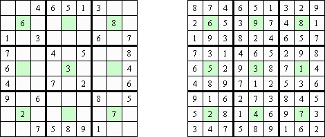
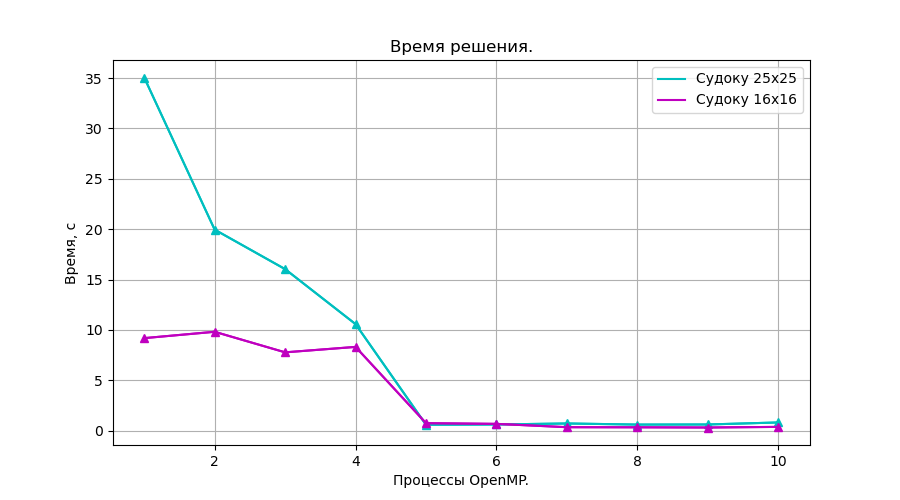
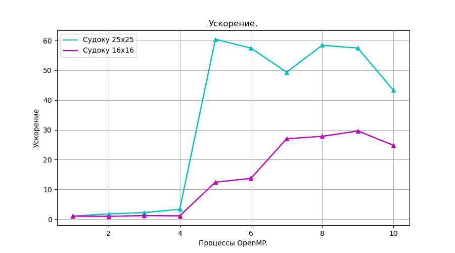
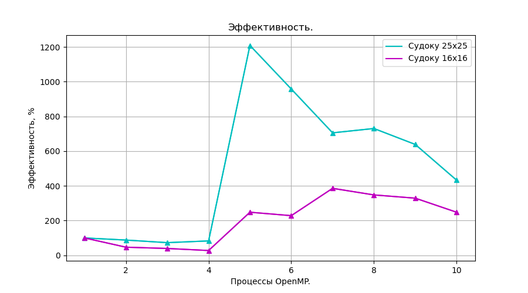

# Sudoku

> [!TIP]
> Многопоточная реализация **Игры Судоку** с использованием **OpenMP**
>
> **Классические правила**: [вот](https://ru.wikipedia.org/wiki/%D0%A1%D1%83%D0%B4%D0%BE%D0%BA%D1%83)

> **Краткое описание**:
>  * Игровое поле представляет собой квадрат размером **NxN**, разделённый на меньшие квадраты со стороной в **sqrt(N)** клетки.
> * В клетках уже в начале игры стоят некоторые числа (от 1 до N), называемые **подсказками**. 
> * Нужно заполнить свободные клетки цифрами от 1 до N так, чтобы в каждой строке, в каждом столбце и в каждом малом квадрате **sqrt(N)x sqrt(N)** каждая цифра встречалась только один раз.

> [!IMPORTANT]
> * **sudokuSolver** - программа, считывающая судоку из файла формата **.json**, находящая (если возможно) решение и печатающая результат на экран.


 


## Содержание

[1. Пример игры](#1)

[2. Сборка ](#2)

[3. Измерения производительности ](#3)


<a name="1"></a>
## Пример игры

### Начальное состояние из файла

Возьмём cудоку 9x9 клеток (примеры есть в *Examples*). Пустые клетки обозначаются нулем.

```
$ cat sudoku.json
```
  ```
{
  "sudoku":
    [
      6, 0, 0, 7, 5, 0, 0, 0, 0,
      0, 0, 0, 8, 0, 0, 6, 3, 0,
      0, 5, 0, 6, 0, 0, 0, 0, 0,
      9, 6, 8, 0, 0, 2, 1, 0, 0,
      0, 0, 0, 0, 0, 0, 0, 4, 0,
      3, 0, 1, 0, 0, 0, 0, 0, 9,
      0, 0, 0, 0, 8, 0, 2, 0, 0,
      0, 0, 9, 0, 0, 0, 7, 0, 4,
      2, 8, 3, 0, 0, 0, 0, 0, 0
    ]
}
  ```
Запустим игру, указав в аргументах запуска количество потоков и входной файл:

```
$ ./sudokuSolver 2 sudoku.json
```
```
Решение:

6 3 2 | 7 5 9 | 4 1 8 
1 9 7 | 8 2 4 | 6 3 5 
8 5 4 | 6 3 1 | 9 7 2 
------+-------+-------
9 6 8 | 3 4 2 | 1 5 7 
7 2 5 | 9 1 8 | 3 4 6 
3 4 1 | 5 7 6 | 8 2 9 
------+-------+-------
4 7 6 | 1 8 5 | 2 9 3 
5 1 9 | 2 6 3 | 7 8 4 
2 8 3 | 4 9 7 | 5 6 1 

Time: 0.000121132
```

Решено правильно! :smile:

-----------------------------------------------------------------------------
<a name="2"></a>
## Сборка
 
 Клонирование и сборка программы *sudokuSolver*:

```
  $ git clone https://github.com/kseniadobrovolskaia/ParallelComputing
  $ cd ParallelComputing/Sudoku/
  $ cmake -B build
  $ cd build/
  $ make
```
 
-----------------------------------------------------------------------------


<a name="3"></a>
## Измерения производительности

> [!TIP]
> Рассчет проводится методом объединения **гуманистического алгоритма** и **алгоритма грубой силы**. Из-за заметного преобладания по количеству операций второго алгоритма над первым был распараллелен только второй алгоритм. Также в нём нет взаимодействия между процессами в отличие от первого.


Для полей 25х25 и 16х16 были измерены времена рассчета состояний в зависимости от числа процессов OpenMP. Рассчеты проводились на 8-ми ядерном компьютере с процессорами Intel.

 

**Видно, что время уменьшается с увеличением числа процессов.** 
По этим данным были вычислены:

* **Ускорение** - отношение времени выполнения лучшего последовательного алгоритма **$T_1$** ко времени выполнения параллельного алгоритма **$T_p$** на **p** процессорах.

**$$S = \frac{T_1}{T_p}$$**

 

**Из графика видно, что ускорение больше числа процессоров. Это называется сверхлинейным ускорением и связано с тем, что для решения на одном процессоре использовался не наилучший последовательный алгоритм.**


* **Эффективность**. Параллельный алгоритм может давать большое ускорение, но использовать процессоры неэффективно. Для оценки масштабируемости параллельного алгоритма используется понятие эффективности:

**$$E = \frac{S}{p}$$**

 

**Видно, что эффективность растёт до увеличения числа процессоров примерно до 6, а затем уменьшается. Таким образом на 6 потоках решать задачу судоку данным алгоритмом наиболее выгодно как по времени, так и по эффективности.**


