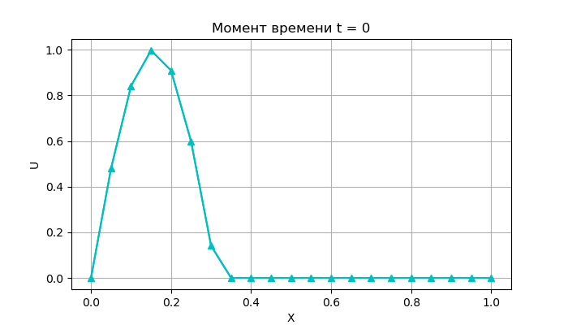
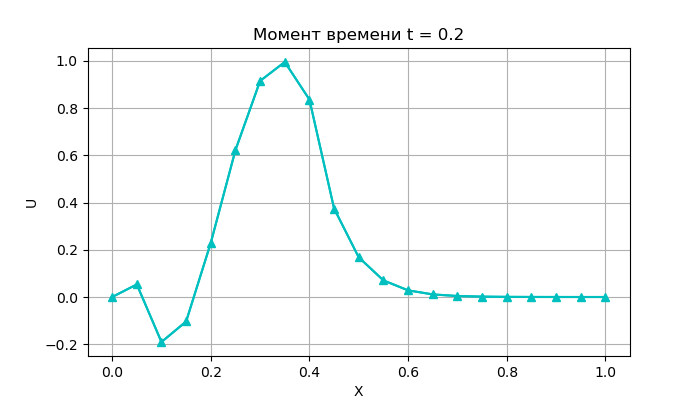
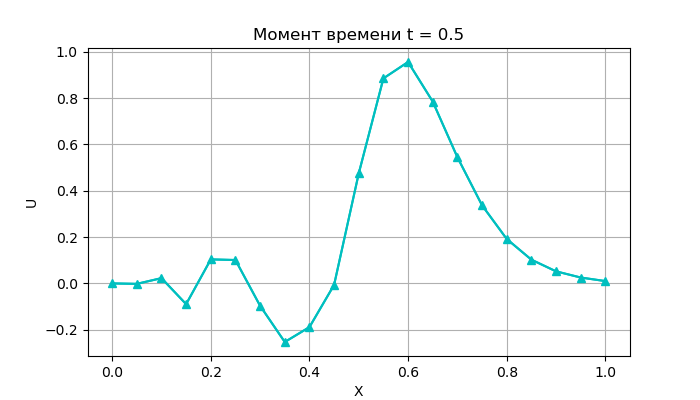
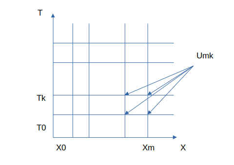
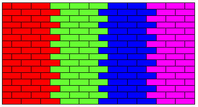
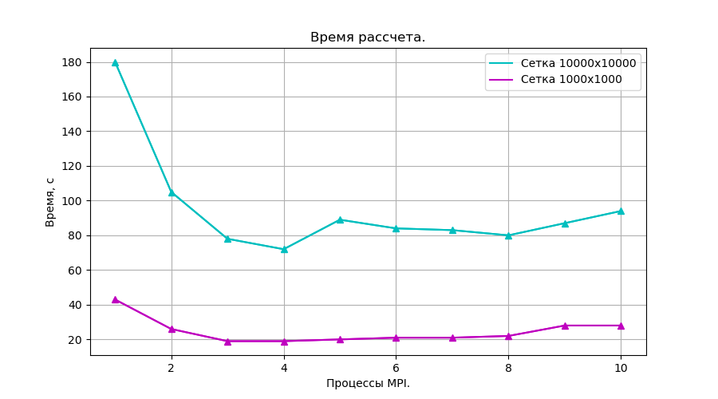
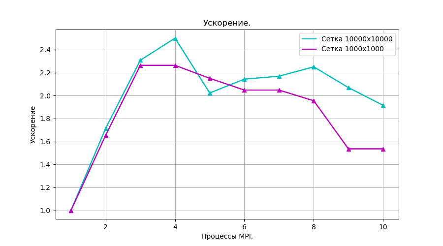
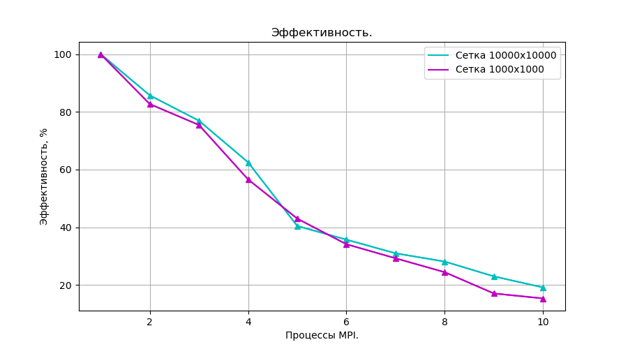

# TransportEquation 

> [!TIP]
> Многопоточная реализация **решения уравнения переноса** с использованием технологии **MPI** (Message Passing Interface).
>


## Сборка и запуск

```
  $ git clone https://github.com/kseniadobrovolskaia/ParallelComputing
  $ cd ParallelComputing/TransportEquation/
  $ cmake -B build
  $ cd build/
  $ make
```

```
mpirun -n 4 ./TransportEq
```

Время рассчета будет напечатано на экране, а все состояния будут сохранены в файл *Calculations.txt*.

 
> [!IMPORTANT]
> Для запуска программы должно быть установлено программное обеспечение для многопоточного программирования **MPI**. В частности компилятор **mpicc** и запускатор **mpirun**. Но скорее всего эти программы уже есть на вашем компьютере.


-----------------------------------------------------------------------------

## Пример рассчета

Общий вид уравнения переноса c начальными и граничными условиями:

$$\frac{dU(t, x)}{dt} + a\frac{dU(t, x)}{dx} = f(t,x), 0 <= t <= T, 0 <= x <= X$$

$$U(0, x) = \phi(x), 0 <= x <= X$$

$$U(t, 0) = \psi(t), 0 <= t <= T$$

Возьмём для примера простое уравнение движения отрезка синусоиды:

$$\frac{dU(t, x)}{dt} + \frac{dU(t, x)}{dx} = 0, 0 <= t <= 1, 0 <= x <= 1$$

$$U(0, x) = \phi(x), 0 <= x <= 1$$

$$U(t, 0) = 0, 0 <= t <= 1$$

$$\phi(x) = sin(10x), 0 <= x <= 0.3$$

$$\phi(x) = 0, 0.3 < x <= 1$$


Проведён рассчет для сетки 20х10, то есть 20 значений координаты и 10 моментов времени. Три временных слоя показаны на графиках.

 
 
 


**Видно, что этот отрезок синусоиды перемещается направо, что описывает физический смысл уравнения переноса.**


-----------------------------------------------------------------------------

## Измерения производительности

> [!TIP]
> В этой программе используется разностная схема **прямоугольник**. 

 

$$\frac{U_{m-1}^{k+1} - U_{m-1}^{k} + U_m^{k+1} - U_{m}^{k}}{2\tau} + \frac{U_{m}^{k+1} - U_{m-1}^{k+1} + U_m^k - U_{m-1}^{k}}{2h} = f_{m+1/2}^{k+1/2}$$


, где $U_m^k = U(k \tau, m h), 0 <= k <= K, 0 <= m <= M$


$\tau = \frac{T}{K}, h = \frac{X}{M}$ 


K, M - количество точек для рассчета по осям времени и координаты. Так образуются сетки KxM.

> [!TIP]
> Рассчет проводится методом **геометрического параллелизма**, то есть ось X разбивается на примерно равные промежутки, которые распределяются между процессами MPI.
> Для рассчета следующего временного слоя процессоры отправляют соседям значения в своих крайних точках, так как они тоже используются для рассчетов.

 


Для сеток 5000x5000, 10000x10000 были измерены времена рассчета состояний в зависимости от числа процессов MPI. Рассчеты проводились на 8-ми ядерном компьютере с процессорами Intel.

 

**Видно, что время уменьшается с увеличением числа процессов до четырёх. Далее время увеличивается. Ускорение за счет увеличения рассчетных узлов компенсируется задержками на передачу сообщений между процессами. А рассчеты на 9-ти и 10-ти процессах вообще не имеют смысла, когда ядер только 8.**


По этим данным были вычислены:

* **Ускорение** - отношение времени выполнения лучшего последовательного алгоритма **$T_1$** ко времени выполнения параллельного алгоритма **$T_p$** на **p** процессорах.

**$$S = \frac{T_1}{T_p}$$**

 

**Из графика видно, что ускорение меньше числа процессоров. Это связано с задержками на обмен сообщениями, а также с наличием операций алгоритма, которые не могут быть выполнены параллельно.**


* **Эффективность**. Параллельный алгоритм может давать большое ускорение, но использовать процессоры неэффективно. Для оценки масштабируемости параллельного алгоритма используется понятие эффективности:

**$$E = \frac{S}{p}$$**

 

**Видно, что эффективность стабильно уменьшается. Но ради ускорения вычислений эти потери допустимы.**


